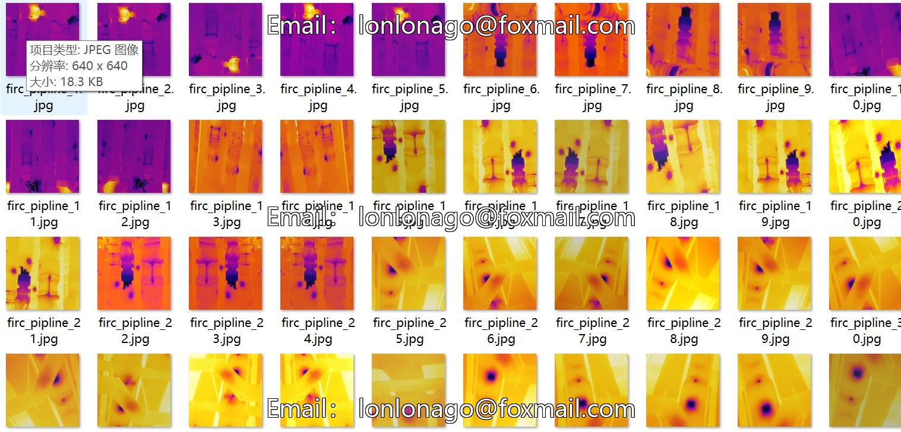
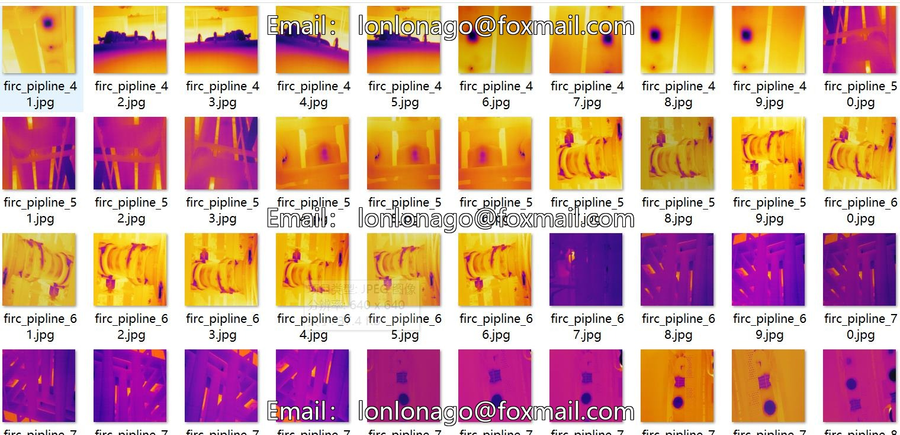
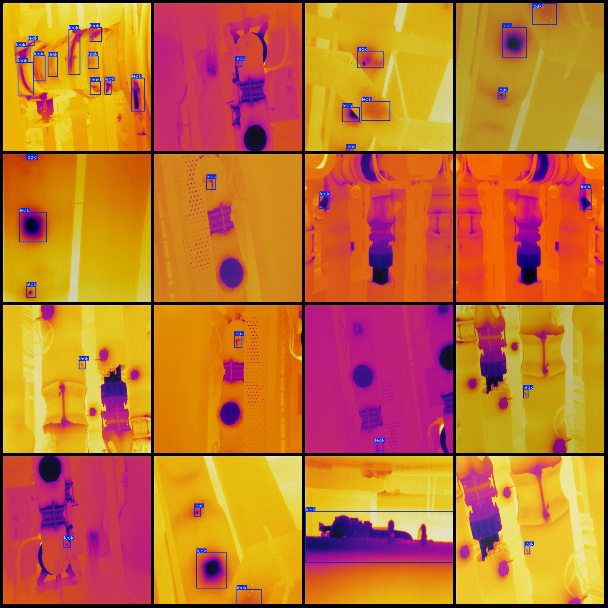
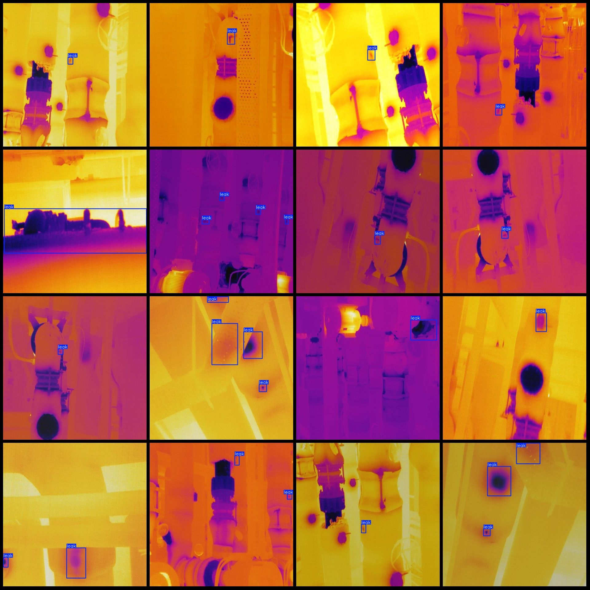

# Infrared Image Water Pipe Leakage Detection Dataset VOC+YOLO Format with 93 Categories

**Dataset Format:** Pascal VOC format + YOLO format (without split path in the txt file, only containing jpg images and corresponding VOC format xml files and YOLO format txt files)

- **Number of Images (jpg Files):** 93
- **Number of Annotations (xml Files):** 93
- **Number of Annotations (txt Files):** 93
- **Number of Annotation Categories:** 1
- **Annotation Category Name:** "leak"
- **Number of Boxes for Each Category:**
  - "leak": 265
- **Total Boxes:** 265
- **Image Resolution:** 640x640
- **Annotation Tool Used:** labelImg
- **Annotation Rules:** Draw boxes around categories
- **Important Notes:** None
- **Special Disclaimer:** This dataset does not guarantee the accuracy of the trained models or weight files.
- **Preview of Images:** N/A

**Annotated Example:**

## Image

Here is a pay link on Stripe ( https://buy.stripe.com/3cs8yP7sY87d0vu9AB ). Please contact me lonlonago@foxmail.com after funding $89, and I will send you a complete data files , thank you!

